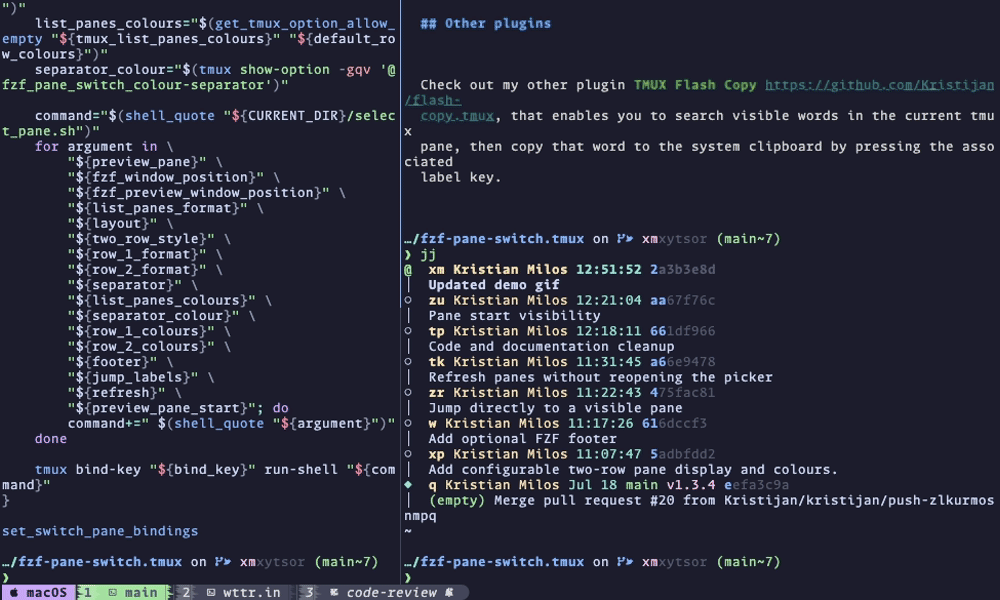

<h1 align="center">
    🔀 TMUX FZF Pane Switch
</h1>



Switch to any TMUX pane, in any session, by searching and filtering using fzf.

Search and filter on any pane details, such as (but not limited to) the `#{window_name}`, `#{pane_title}`, or `#{pane_current_command}`. If a pane cannot be found using the search criteria, the plugin will offer to create a new window in the current session.

## Requirements

* [fzf](https://github.com/junegunn/fzf) >= 0.71.0 (requires cross-reload item identity with `--id-nth`). I tested with 0.74.2.
* [tmux](https://github.com/tmux/tmux) >= 3.3. I tested with 3.7b.

## Installation

### Using TPM (recommended)

1. Install [TPM (Tmux Plugin Manager)](https://github.com/tmux-plugins/tpm).

2. Add `tmux-fzf-pane-switch` to your `~/.tmux.conf`:

    ```bash
    set -g @plugin 'kristijan/fzf-pane-switch.tmux'
    ```

3. Start tmux and install the plugin.

    Press `<tmux_prefix> + I` (capital i, as in Install) to install the plugin.

    Press `<tmux_prefix> + U` (capital u, as in Update) to update the plugin.

### Manual installation

1. Clone this repository to your desired location:

    ```bash
    git clone https://github.com/kristijan/fzf-pane-switch.tmux.git ~/.tmux/plugins/fzf-pane-switch.tmux
    ```

2. Add the following to your `~/.tmux.conf`:

    ```bash
    run-shell ~/.tmux/plugins/fzf-pane-switch.tmux/select_pane.tmux
    ```

    Any customisation variables should be set **BEFORE** the `run-shell` line so they're correctly sourced.

    For example:

    ```bash
    set -g @fzf_pane_switch_list-panes-format "session_name window_name pane_title pane_current_command"
    run-shell ~/.tmux/plugins/fzf-pane-switch.tmux/select_pane.tmux
    ```

3. Reload your tmux configuration:

    ```bash
    tmux source-file ~/.tmux.conf
    ```

## Customise

You can override the following options in your `tmux.conf` file.

### Key binding

```bash
set -g @fzf_pane_switch_bind-key "key binding"
```

Default is `prefix + s`, which replaces the tmux default session select (tmux default: `choose-tree -Zs -O name`)

### fzf window position

```bash
set -g @fzf_pane_switch_window-position "position"
```

Default is `center,70%,80%`. You can use any options allowed [https://man.archlinux.org/man/fzf.1.en#tmux](https://man.archlinux.org/man/fzf.1.en#tmux).

### fzf pane preview

```bash
set -g @fzf_pane_switch_preview-pane "[true|false]"
```

Default is `true`

When preview is enabled, press `Ctrl-/` to close or reopen the preview window.

### fzf footer

```bash
set -g @fzf_pane_switch_footer "[true|false]"
```

Default is `false`, which leaves the footer hidden. When enabled, the footer lists
the available pane-switch actions and their keys. Actions that are disabled, such
as the preview when `@fzf_pane_switch_preview-pane` is `false`, are omitted.
Keys are shown in bold brackets and action descriptions are dimmed, while both
inherit the colours from your fzf theme.

### Jump directly to a visible pane

```bash
set -g @fzf_pane_switch_jump-labels "[true|false]"
```

Default is `false`. When enabled, press `Alt-J` to display a label on each
visible pane, then press its label to switch to that pane immediately. If the
optional footer is enabled, it also shows `[Alt-J] Jump`.

### Refresh panes

```bash
set -g @fzf_pane_switch_refresh "[true|false]"
```

Default is `false`. When enabled, press `Ctrl-R` to regenerate the pane list
while preserving the query and tracking the highlighted pane by its pane ID.
If the preview is enabled, its contents are recaptured as part of the refresh.
If the optional footer is enabled, it also shows `[Ctrl-R] Refresh`.

### fzf pane preview position

Only when `@fzf_pane_switch_preview-pane` is `true`.

```bash
set -g @fzf_pane_switch_preview-pane-position "position"
```

Default is `right,,,nowrap`. You can use any options allowed [https://man.archlinux.org/man/fzf.1.en#preview~3](https://man.archlinux.org/man/fzf.1.en#preview~3).

### tmux list-panes format

This is the output format of `tmux list-panes` that you see in the fzf window. You can use this to match on other tmux formats.

```bash
set -g @fzf_pane_switch_list-panes-format "FORMATS"
```

Default is `pane_id session_name window_name pane_title pane_current_command`.

> [!TIP]
> You can use any tmux FORMAT option allowed [https://www.man7.org/linux/man-pages/man1/tmux.1.html#FORMATS](https://www.man7.org/linux/man-pages/man1/tmux.1.html#FORMATS). String manipulation should also work. For example, the `pane_id` by default is shown with a leading percent symbol (e.g. `%3`). You can remove this by setting `set -g @fzf_pane_switch_list-panes-format "s/%//:pane_id session_name window_name pane_title pane_current_command"`

### Pane layout

The default `one-row` layout is unchanged. Enable the two-row layout with:

```bash
set -g @fzf_pane_switch_layout "two-row"
```

Its default representation is:

```text
pane_title │ pane_current_command
session_name │ window_name
```

`@fzf_pane_switch_layout` accepts `one-row` (default) or `two-row`.

The internal pane ID is hidden in the two-row layout. Add `pane_id` to either row format if you want it displayed and searchable.

When supported by the installed fzf version, a horizontal rule separates each two-row pane entry. The one-row layout does not add gaps or rules.

### Two-row style

```bash
set -g @fzf_pane_switch_two-row-style "plain"
```

The setting applies only to the two-row layout and accepts:

* `plain` (default) — two unadorned rows
* `indented` — a pane marker on the first row and an indented context row
* `connected` — `╭─` and `╰─` rails connect the two rows

### Two-row formats and separator

Each row uses the same whitespace-separated tmux format syntax as `@fzf_pane_switch_list-panes-format`:

```bash
set -g @fzf_pane_switch_row-1-format "pane_title pane_current_command"
set -g @fzf_pane_switch_row-2-format "session_name window_name"
set -g @fzf_pane_switch_separator "│"
```

Both row formats must contain at least one value. The separator may be any non-empty, single-line literal text except reserved control characters.

For example:

```bash
set -g @fzf_pane_switch_layout "two-row"
set -g @fzf_pane_switch_two-row-style "connected"
set -g @fzf_pane_switch_row-1-format "pane_title pane_current_command pane_pid"
set -g @fzf_pane_switch_row-2-format "session_name window_name pane_current_path"
set -g @fzf_pane_switch_separator "·"
```

### Pane-list colours

Colours are opt-in. For two-row layouts, configure colours positionally alongside each row format:

```bash
set -g @fzf_pane_switch_row-1-colours "#89b4fa #a6e3a1"
set -g @fzf_pane_switch_row-2-colours "#f9e2af #cba6f7"
set -g @fzf_pane_switch_colour-separator "#6c7086"
```

Each colour maps to the format value in the same position. The number of entries must exactly match the corresponding row format.

This also allows complex tmux expressions to be coloured:

```bash
set -g @fzf_pane_switch_row-2-format \
  "session_name window_name s|/Users/[^/]*|~|:pane_current_path"
set -g @fzf_pane_switch_row-2-colours \
  "#f9e2af #cba6f7 #89b4fa"
```

Use `none` to explicitly leave a position uncoloured:

```bash
set -g @fzf_pane_switch_row-1-colours "#89b4fa none"
set -g @fzf_pane_switch_row-2-colours "#f9e2af none #89b4fa"
```

If a positional colour option is unset, all values in that row remain uncoloured.

Add one or more ANSI attributes after a colour using colon-separated values:

```bash
set -g @fzf_pane_switch_row-1-colours "gray:dim green:italic"
set -g @fzf_pane_switch_row-2-colours \
  "#f9e2af:bold:underline none #89b4fa"
```

Supported attributes are:

```text
bold dim italic underline reverse strikethrough
```

Attributes apply only to positional list and row colours. `none` must be used by itself, and the separator colour accepts a colour without attributes.

The one-row layout uses a positional list matching `@fzf_pane_switch_list-panes-format`:

```bash
set -g @fzf_pane_switch_list-panes-colours \
  "none #f9e2af #cba6f7 #89b4fa #a6e3a1"
```

The palette above is an example, not the runtime default. With no colour options, the plugin emits no ANSI colour codes and your existing `FZF_DEFAULT_OPTS` continues to control the appearance.

Colour values may be six-digit hex or one of fzf's documented foreground names:

```text
black red green yellow blue magenta cyan white
bright-black bright-red bright-green bright-yellow
bright-blue bright-magenta bright-cyan bright-white
gray grey
```

Three-digit hex, numeric palette indexes, `-1`, backgrounds, unsupported attributes, and complete fzf `--color` fragments are rejected. Complex tmux format expressions can be coloured and styled like any other positional value.

fzf themes can override input foreground colours. If you want input colours to remain visible in normal, selected, and matched text, configure the relevant theme foregrounds to use `-1` in `FZF_DEFAULT_OPTS`.

Invalid layout, style, row, separator, or colour settings show an option-specific tmux message and do not open the switcher.

## Tools used in demonstration

* TMUX theme is [catppuccin](https://github.com/catppuccin/tmux) mocha.
* ZSH shell prompt is [starship](https://starship.rs)
* `fzf` theme is [catppuccin](https://github.com/catppuccin/fzf) mocha.

## Inspiration

I pretty much retrofitted the [brokenricefilms/tmux-fzf-session-switch](https://github.com/brokenricefilms/tmux-fzf-session-switch) TPM plugin. So, if you're looking for something to switch tmux sessions only, go check it out.

## Other plugins

Check out my other plugin [TMUX Flash Copy](https://github.com/Kristijan/flash-copy.tmux), that enables you to search visible words in the current tmux pane, then copy that word to the system clipboard by pressing the associated label key.
