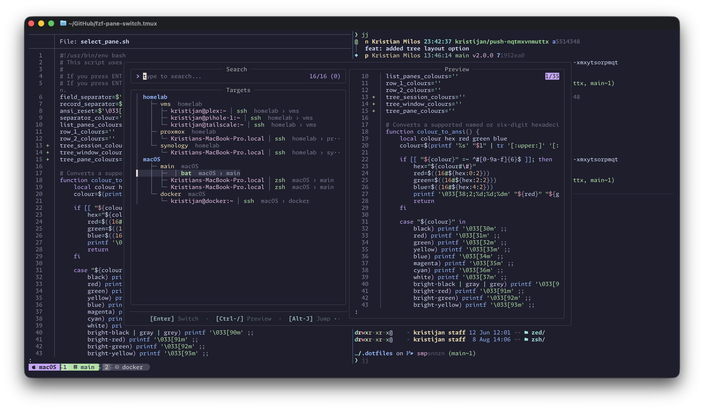
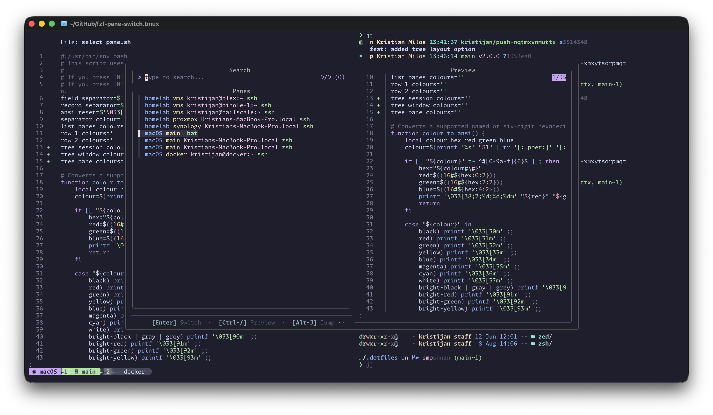
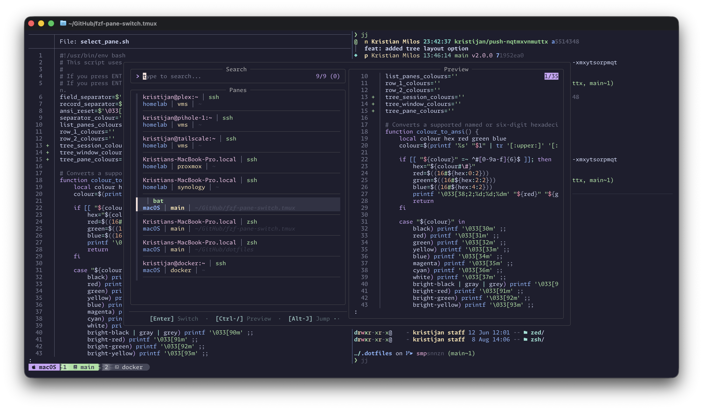

<h1 align="center">
    🔀 TMUX FZF Pane Switch
</h1>

<p align="center">
Switch to any TMUX pane, in any session, by searching and filtering using fzf.
</p



<p align="center">
Search and filter on any pane details, such as (but not limited to) the <code>#{window_name}</code>, <code>#{pane_title}</code>, or <code>#{pane_current_command}</code>. If a pane cannot be found using the search criteria, the plugin will offer to create a new window in the current session.
</p>

| One Row                                                                     | Two Rows                                                                    |
| --------------------------------------------------------------------------- | --------------------------------------------------------------------------- |
|  |  |

## Requirements

- [fzf](https://github.com/junegunn/fzf) >= 0.71.0
- [tmux](https://github.com/tmux/tmux) >= 3.3

_I've tested this plugin with tmux 3.7b and fzf 0.74.2._

## Installation

<details>

<summary>Using TPM Redux (recommended)</summary>

1. Install [TPM Redux (Tmux Plugin Manager)](https://github.com/RyanMacG/tpm-redux).

2. Add `tmux-fzf-pane-switch` to your `~/.tmux.conf`:

   ```bash
   set -g @plugin 'kristijan/fzf-pane-switch.tmux'
   ```

3. Start tmux and install the plugin.

   Press `<tmux_prefix> + I` (capital i, as in Install) to install the plugin.

   Press `<tmux_prefix> + U` (capital u, as in Update) to update the plugin.

</details>

<details>

<summary>Manual installation</summary>

1. Clone this repository to your desired location:

   ```bash
   git clone https://github.com/kristijan/fzf-pane-switch.tmux.git ~/.tmux/plugins/fzf-pane-switch.tmux
   ```

2. Add the following to your `~/.tmux.conf`:

   ```bash
   run-shell ~/.tmux/plugins/fzf-pane-switch.tmux/select_pane.tmux
   ```

   Any customisation variables should be set **BEFORE** the `run-shell` line so they're correctly sourced.

   For example:

   ```bash
   set -g @fzf_pane_switch_list-panes-format "session_name window_name pane_title pane_current_command"
   run-shell ~/.tmux/plugins/fzf-pane-switch.tmux/select_pane.tmux
   ```

3. Reload your tmux configuration:

   ```bash
   tmux source-file ~/.tmux.conf
   ```

</details>

## Configuration

Set plugin options in `tmux.conf` before loading the plugin. See
[Configuration](CONFIGURATION.md) for defaults, accepted values, and examples.

### General

| Setting                                                                                            | Description                                                  |
| -------------------------------------------------------------------------------------------------- | ------------------------------------------------------------ |
| [`@fzf_pane_switch_bind-key`](CONFIGURATION.md#fzf_pane_switch_bind-key)                           | tmux key binding that opens the pane switcher.               |
| [`@fzf_pane_switch_bind-key-mode`](CONFIGURATION.md#fzf_pane_switch_bind-key-mode)                 | Selects a prefix or root key binding.                        |
| [`@fzf_pane_switch_window-position`](CONFIGURATION.md#fzf_pane_switch_window-position)             | Size and position of the fzf tmux popup.                     |
| [`@fzf_pane_switch_preview-pane`](CONFIGURATION.md#fzf_pane_switch_preview-pane)                   | Shows a preview of the highlighted pane.                     |
| [`@fzf_pane_switch_preview-pane-start`](CONFIGURATION.md#fzf_pane_switch_preview-pane-start)       | Sets whether an enabled preview starts visible or hidden.    |
| [`@fzf_pane_switch_preview-pane-position`](CONFIGURATION.md#fzf_pane_switch_preview-pane-position) | Size and position of the preview window.                     |
| [`@fzf_pane_switch_footer`](CONFIGURATION.md#fzf_pane_switch_footer)                               | Shows enabled actions and their keys.                        |
| [`@fzf_pane_switch_jump-labels`](CONFIGURATION.md#fzf_pane_switch_jump-labels)                     | Enables direct selection of visible panes using jump labels. |
| [`@fzf_pane_switch_refresh`](CONFIGURATION.md#fzf_pane_switch_refresh)                             | Enables refreshing pane details and preview content.         |

### Pane presentation

| Setting                                                                                        | Description                                      |
| ---------------------------------------------------------------------------------------------- | ------------------------------------------------ |
| [`@fzf_pane_switch_layout`](CONFIGURATION.md#fzf_pane_switch_layout)                           | Selects the one-row, two-row, or tree layout.    |
| [`@fzf_pane_switch_list-panes-format`](CONFIGURATION.md#fzf_pane_switch_list-panes-format)     | Configures fields in the one-row layout.         |
| [`@fzf_pane_switch_two-row-style`](CONFIGURATION.md#fzf_pane_switch_two-row-style)             | Selects the visual treatment of two-row entries. |
| [`@fzf_pane_switch_row-1-format`](CONFIGURATION.md#fzf_pane_switch_row-1-format)               | Configures fields in the first row.              |
| [`@fzf_pane_switch_row-2-format`](CONFIGURATION.md#fzf_pane_switch_row-2-format)               | Configures fields in the second row.             |
| [`@fzf_pane_switch_tree-session-format`](CONFIGURATION.md#fzf_pane_switch_tree-session-format) | Configures session rows in tree mode.            |
| [`@fzf_pane_switch_tree-window-format`](CONFIGURATION.md#fzf_pane_switch_tree-window-format)   | Configures window rows in tree mode.             |
| [`@fzf_pane_switch_tree-pane-format`](CONFIGURATION.md#fzf_pane_switch_tree-pane-format)       | Configures pane rows in tree mode.               |
| [`@fzf_pane_switch_separator`](CONFIGURATION.md#fzf_pane_switch_separator)                     | Sets the separator between values.               |

### Colours

| Setting                                                                                      | Description                                       |
| -------------------------------------------------------------------------------------------- | ------------------------------------------------- |
| [`@fzf_pane_switch_list-panes-colours`](CONFIGURATION.md#fzf_pane_switch_list-panes-colours) | Assigns positional colours in the one-row layout. |
| [`@fzf_pane_switch_row-1-colours`](CONFIGURATION.md#fzf_pane_switch_row-1-colours)           | Assigns positional colours in the first row.      |
| [`@fzf_pane_switch_row-2-colours`](CONFIGURATION.md#fzf_pane_switch_row-2-colours)           | Assigns positional colours in the second row.     |
| [Tree session/window/pane colour options](CONFIGURATION.md#tree-positional-colours)          | Assign positional colours to tree node fields.    |
| [`@fzf_pane_switch_colour-separator`](CONFIGURATION.md#fzf_pane_switch_colour-separator)     | Sets the value-separator colour.                  |

## Tools used in screenshots

- TMUX styling is [tmux-powerkit](https://github.com/fabioluciano/tmux-powerkit) with a custom catppuccin mocha theme.
- ZSH shell prompt is [starship](https://starship.rs)
- `fzf` theme is [catppuccin](https://github.com/catppuccin/fzf) mocha.

## Inspiration

I pretty much retrofitted the [brokenricefilms/tmux-fzf-session-switch](https://github.com/brokenricefilms/tmux-fzf-session-switch) TPM plugin. So, if you're looking for something to switch tmux sessions only, go check it out.

## Other plugins

Check out my other plugin [TMUX Flash Copy](https://github.com/Kristijan/flash-copy.tmux), that enables you to search visible words in the current tmux pane, then copy that word to the system clipboard by pressing the associated label key.
